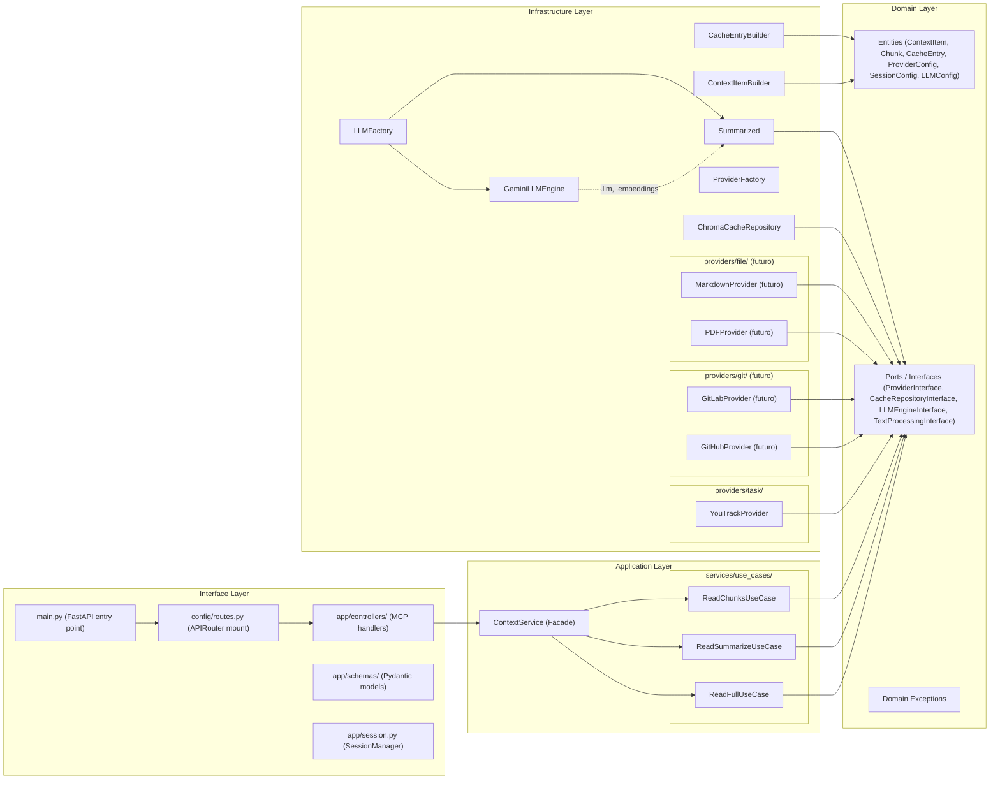
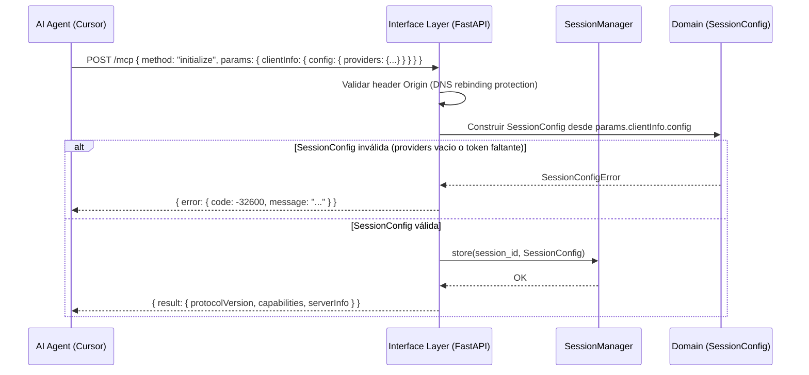
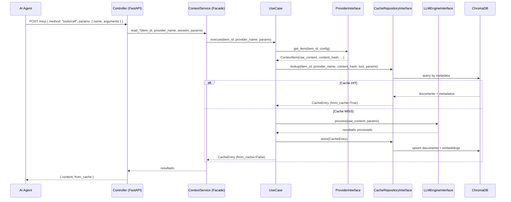
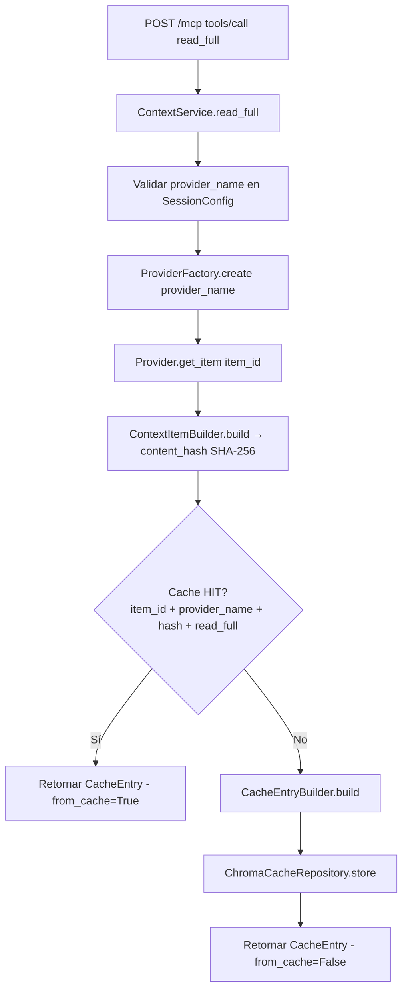
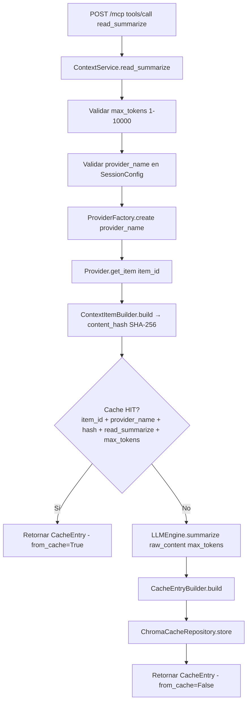
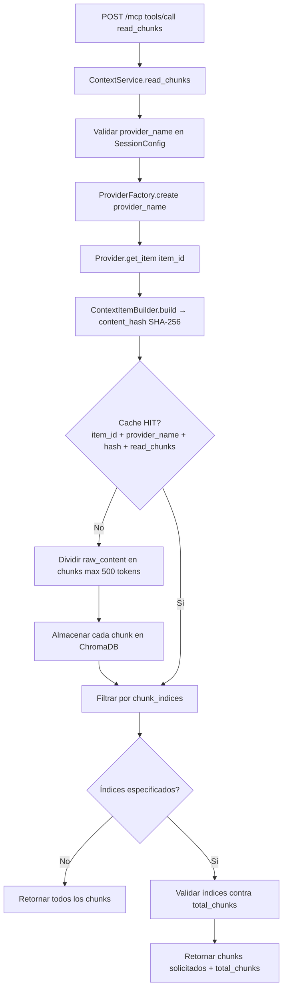

# Documento de Diseño Técnico: ContextForge

## Visión General

`ContextForge` es un servidor MCP (Model Context Protocol) dockerizado en Python cuyo objetivo principal es **optimizar el consumo de tokens** al proporcionar contexto preciso de ítems a agentes de AI. Expone tres herramientas (`read_full`, `read_summarize`, `read_chunks`) con caché persistente en ChromaDB.

El servidor actúa como intermediario inteligente: el agente de AI solicita exactamente el nivel de detalle que necesita, y ContextForge recupera, procesa, cachea y entrega ese contexto de forma eficiente. Los proveedores se configuran desde el cliente (ej. Cursor) en el mensaje `initialize` MCP. El motor LLM se configura en el servidor mediante variables de entorno (`LLM_ENGINE`, `LLM_API_KEY`).

```mermaid
graph TD
    Agent["AI Agent (Cursor)"] -->|MCP Streamable HTTP| MCP["Interface Layer (FastAPI + MCP)"]
    MCP -->|invoca| SVC["Application Layer (ContextService Facade)"]
    SVC -->|delega| UC["Use Cases (ReadFull, ReadSummarize, ReadChunks)"]
    UC -->|usa interfaces| Domain["Domain Layer (Entities + Ports)"]
    UC -->|orquesta| Infra["Infrastructure Layer"]
    Infra -->|implementa| Domain
    Infra --> Provider["providers/ (YouTrack, Jira...)"]
    Infra --> Cache["cache/ (ChromaDB)"]
    Infra --> LLM["llm/ (Gemini + LangChain)"]
    Infra --> Builders["builders/ (ContextItemBuilder, CacheEntryBuilder)"]
    Provider -->|HTTP REST| YouTrack["YouTrack API"]
    Cache -->|Docker Volume| Disk["Persistent Storage"]
```



---

## Arquitectura

### Estilo Arquitectónico: Clean Architecture + SOLID

ContextForge sigue **Clean Architecture** con cuatro capas concéntricas. Las dependencias apuntan siempre hacia adentro (hacia el dominio). Ninguna capa interna conoce las capas externas.



### Principios SOLID Aplicados

| Principio | Aplicación |
|-----------|-----------|
| **S** - Single Responsibility | Cada caso de uso tiene una única responsabilidad (leer, resumir, fragmentar). Cada controller maneja un único endpoint MCP. |
| **O** - Open/Closed | `ProviderFactory` y `LLMFactory` permiten agregar implementaciones sin modificar código existente |
| **L** - Liskov Substitution | `YouTrackProvider` y `JiraProvider` son intercambiables vía `ProviderInterface` |
| **I** - Interface Segregation | Interfaces genéricas: proveedor (`ProviderInterface`), caché (`CacheRepositoryInterface`), motor LLM (`LLMEngineInterface`) y procesamiento de texto (`TextProcessingInterface`). Protocolos `LLM` y `Embeddings` permiten implementar con cualquier motor (Gemini, OpenAI, Grok, etc.) |
| **D** - Dependency Inversion | Los casos de uso dependen de interfaces, no de implementaciones concretas |

---

## Patrones de Diseño

### 1. Factory (x2)

**`ProviderFactory`** y **`LLMFactory`** implementan el patrón Factory con registro dinámico, permitiendo agregar nuevas implementaciones sin modificar el factory (Open/Closed Principle).

### 2. Facade

**`ContextService`** es la fachada de la Application Layer. Simplifica la invocación de los tres casos de uso desde los controllers, recibiendo `SessionConfig` y delegando a `ReadFullUseCase`, `ReadSummarizeUseCase` y `ReadChunksUseCase`.

### 3. Builder (x2)

- **`ContextItemBuilder`**: construye el objeto `ContextItem` desde campos genéricos (no desde JSON específico de proveedor). Cada proveedor es responsable de transformar su respuesta JSON a campos genéricos antes de pasarlos al builder. Esto permite que el builder sea agnóstico al proveedor y cumpla con el principio Open/Closed.
- **`CacheEntryBuilder`**: construye `CacheEntry` con todos sus metadatos de forma fluida. Este builder NO se ve afectado por el cambio porque recibe un `ContextItem` ya parseado.

### 4. Strategy (implícito en Factory)

Cada proveedor e implementación LLM es una estrategia intercambiable. El factory selecciona la estrategia correcta en tiempo de ejecución.

### 5. Repository

`CacheRepositoryInterface` abstrae ChromaDB, desacoplando la lógica de negocio del almacenamiento vectorial concreto.

---

## Estructura de Directorios

```
contextforge/
├── main.py                          # Punto de entrada FastAPI (crea app, monta routers)
├── config/
│   └── routes.py                    # Monta todos los APIRouter en la app FastAPI
├── app/
│   ├── controllers/
│   │   ├── __init__.py
│   │   ├── application_controller.py # Base: recibe APIRouter, guarda en self.router
│   │   ├── mcp_controller.py         # MCPController(ApplicationController): POST+GET /mcp/
│   │   └── health_controller.py      # HealthController(ApplicationController): GET /health
│   ├── exceptions/
│   │   ├── __init__.py
│   │   └── exception_handler.py      # Handlers globales por tipo de excepción + dict exception_handlers
│   ├── schemas/
│   │   ├── __init__.py
│   │   ├── mcp_request.py            # Pydantic: ToolCallRequest, SessionConfigSchema
│   │   ├── mcp_response.py           # Pydantic: ToolCallResponse, ChunksResponse, ChunkItem
│   │   └── errors.py                 # ErrorResponse (para documentar errores en OpenAPI)
│   └── session.py                    # SessionManager: almacena SessionConfig por sesión
├── src/
│   ├── domain/
│   │   ├── __init__.py
│   │   ├── entities.py              # ContextItem, Chunk, CacheEntry, ProviderConfig, SessionConfig, LLMConfig
│   │   ├── interfaces.py            # ProviderInterface, CacheRepositoryInterface, LLMEngineInterface
│   │   └── exceptions.py            # Jerarquía completa de excepciones
│   ├── application/
│   │   ├── __init__.py
│   │   └── services/
│   │       ├── __init__.py
│   │       ├── context_service.py   # ContextService (Facade)
│   │       └── use_cases/
│   │           ├── __init__.py
│   │           ├── read_full.py     # ReadFullUseCase
│   │           ├── read_summarize.py # ReadSummarizeUseCase
│   │           └── read_chunks.py   # ReadChunksUseCase
│   └── infrastructure/
│       ├── providers/
│       │   ├── __init__.py          # Registro de todos los proveedores en ProviderFactory
│       │   ├── factory.py           # ProviderFactory: registro name → (category, class)
│       │   ├── task/
│       │   │   ├── __init__.py
│       │   │   ├── youtrack.py      # YouTrackProvider (MVP funcional)
│       │   │   └── jira.py          # JiraProvider (stub)
│       │   ├── git/
│       │   │   ├── __init__.py
│       │   │   ├── github.py        # GitHubProvider (stub futuro)
│       │   │   └── gitlab.py        # GitLabProvider (stub futuro)
│       │   └── file/
│       │       ├── __init__.py
│       │       ├── pdf.py           # PDFProvider (stub futuro)
│       │       └── markdown.py      # MarkdownProvider (stub futuro)
│       ├── llm/
│       │   ├── __init__.py          # Registro en LLMFactory
│       │   ├── factory.py           # LLMFactory
│       │   ├── gemini.py            # GeminiLLMEngine (LCEL chain: prompt | llm | StrOutputParser)
│       │   └── openai.py            # OpenAILLMEngine (stub)
│       ├── templates_prompts/
│       │   ├── __init__.py
│       │   ├── summarize.py          # SUMMARIZE_PROMPT
│       │   ├── summarize_map.py      # SUMMARIZE_MAP_PROMPT
│       │   └── summarize_reduce.py   # SUMMARIZE_REDUCE_PROMPT
│       ├── tools/
│       │   ├── __init__.py
│       │   ├── tokenizer.py          # TiktokenTokenizer
│       │   └── summarizer/
│       │       ├── __init__.py
│       │       ├── summarize.py      # Summarized (TextProcessingInterface)
│       │       └── summarizer_engine.py # Summarizer (map-reduce)
│       ├── cache/
│       │   ├── __init__.py
│       │   └── chroma.py            # ChromaCacheRepository
│       └── builders/
│           ├── __init__.py
│           ├── context_item.py      # ContextItemBuilder
│           └── cache_entry.py       # CacheEntryBuilder
├── settings.py                      # Carga y validación de variables de entorno (pydantic-settings)
├── tests/
│   ├── unit/
│   │   ├── test_read_full_usecase.py
│   │   ├── test_tokenizer.py
│   │   ├── test_chroma_cache.py
│   │   └── ...
│   ├── property/
│   │   ├── test_llm_engine.py
│   │   ├── test_properties_chunks.py
│   │   └── test_properties_providers.py
│   └── integration/
│       └── test_mcp_http.py
├── Dockerfile
├── docker-compose.yml
├── .env.example
├── requirements.txt
├── pyproject.toml
└── .venv/
```

---

## Interface Layer: Patrón FastAPI

El patrón FastAPI sigue la guía de referencia del proyecto: `main.py` crea la app, registra exception handlers globales, añade middlewares y delega el montaje de rutas a `config/routes.py`. Los controllers son **clases** que heredan de `ApplicationController` y registran sus endpoints en `__init__`. Los schemas Pydantic son objetos planos sin envoltura `success`/`data`. Los errores se manejan con exception handlers globales que retornan `JSONResponse` con solo `message`.

La estructura de controllers actualizada en el árbol de directorios:

```
app/
├── controllers/
│   ├── application_controller.py    # Base: recibe APIRouter, guarda en self.router
│   ├── mcp_controller.py            # MCPController(ApplicationController)
│   └── health_controller.py         # HealthController(ApplicationController)
├── exceptions/
│   └── exception_handler.py         # Handlers globales por tipo de excepción
├── schemas/
│   ├── mcp_request.py
│   ├── mcp_response.py
│   └── errors.py                    # ErrorResponse (para documentar en OpenAPI)
└── session.py
```

### main.py

```python
# main.py
from fastapi import FastAPI
from config.routes import Routes
from settings import settings
from src.infrastructure.cache.chroma import ChromaCacheRepository
from src.infrastructure.llm.factory import LLMFactory
from src.application.services.context_service import ContextService
from app.session import SessionManager
from app.exceptions.exception_handler import exception_handlers

app = FastAPI(
    title="ContextForge MCP Server",
    version="1.0.0",
    docs_url="/docs",
    redoc_url="/redoc",
    openapi_url="/openapi.json",
)

# Registrar exception handlers globales
for exc_class, handler in exception_handlers.items():
    app.add_exception_handler(exc_class, handler)

# Inicializar infraestructura (singleton por proceso)
cache = ChromaCacheRepository(host=settings.CHROMA_HOST, port=settings.CHROMA_PORT)
llm = LLMFactory(settings.get_llm_config()).create()
context_service = ContextService(cache=cache, llm=llm)
session_manager = SessionManager()

Routes(app, context_service=context_service, session_manager=session_manager).register()
```

### config/routes.py

```python
# config/routes.py
from fastapi import FastAPI, APIRouter
from app.controllers.mcp_controller import MCPController
from app.controllers.health_controller import HealthController

class Routes:
    def __init__(self, app: FastAPI, **deps):
        self._app = app
        self._deps = deps

    def register(self) -> None:
        router = APIRouter(responses={404: {"description": "Not found"}})
        self._app.include_router(MCPController(router, **self._deps).router, prefix="/mcp")
        self._app.include_router(HealthController(router).router)
```

### app/controllers/application_controller.py

```python
# app/controllers/application_controller.py
from fastapi import APIRouter

class ApplicationController:
    """Base: recibe un APIRouter y lo guarda en self.router."""
    def __init__(self, router: APIRouter):
        self.router = router
```

### app/controllers/mcp_controller.py

```python
# app/controllers/mcp_controller.py
from fastapi import APIRouter, status
from fastapi.responses import JSONResponse
from app.controllers.application_controller import ApplicationController
from app.schemas.mcp_request import ToolCallRequest
from app.schemas.mcp_response import ToolCallResponse, ChunksResponse
from app.schemas.errors import ErrorResponse
from app.session import SessionManager
from src.application.services.context_service import ContextService

class MCPController(ApplicationController):
    def __init__(self, router: APIRouter, context_service: ContextService, session_manager: SessionManager):
        super().__init__(router)
        self.router.tags = ["MCP"]
        self._context_service = context_service
        self._session_manager = session_manager

        @self.router.post(
            "/",
            status_code=status.HTTP_200_OK,
            responses={
                400: {"model": ErrorResponse, "description": "Sesión inválida o método desconocido"},
                422: {"model": ErrorResponse, "description": "Error de dominio (proveedor, ítem, validación)"},
            },
        )
        async def handle_mcp(request: ToolCallRequest):
            """Endpoint único Streamable HTTP MCP (POST). Despacha según method."""
            if request.method == "initialize":
                return _handle_initialize(request, self._session_manager)
            if request.method == "tools/list":
                return _handle_tools_list(request)
            if request.method == "tools/call":
                return await _handle_tool_call(request, self._context_service, self._session_manager)
            return JSONResponse(
                {"message": f"Método '{request.method}' no soportado"},
                status_code=400,
            )

        @self.router.get(
            "/",
            status_code=status.HTTP_200_OK,
        )
        async def mcp_sse():
            """Endpoint GET para SSE (Streamable HTTP MCP spec 2025-03-26)."""
            return JSONResponse({"message": "SSE endpoint activo"})
```

### app/exceptions/exception_handler.py

```python
# app/exceptions/exception_handler.py
from fastapi import Request
from fastapi.responses import JSONResponse
from src.domain.exceptions import (
    SessionConfigError, ItemNotFoundError, AuthenticationError,
    ValidationError, ProviderNotRegisteredError, ContextForgeError,
)

async def session_config_error_handler(request: Request, exc: SessionConfigError):
    return JSONResponse(status_code=400, content={"message": str(exc)})

async def item_not_found_handler(request: Request, exc: ItemNotFoundError):
    return JSONResponse(status_code=404, content={"message": str(exc)})

async def authentication_error_handler(request: Request, exc: AuthenticationError):
    return JSONResponse(status_code=401, content={"message": str(exc)})

async def validation_error_handler(request: Request, exc: ValidationError):
    return JSONResponse(status_code=422, content={"message": str(exc)})

async def provider_not_registered_handler(request: Request, exc: ProviderNotRegisteredError):
    return JSONResponse(status_code=422, content={"message": str(exc)})

async def generic_contextforge_handler(request: Request, exc: ContextForgeError):
    return JSONResponse(status_code=422, content={"message": str(exc)})

# Diccionario que main.py itera para registrar con app.add_exception_handler()
exception_handlers: dict = {
    SessionConfigError: session_config_error_handler,
    ItemNotFoundError: item_not_found_handler,
    AuthenticationError: authentication_error_handler,
    ValidationError: validation_error_handler,
    ProviderNotRegisteredError: provider_not_registered_handler,
    ContextForgeError: generic_contextforge_handler,
}
```

### app/schemas/errors.py

```python
# app/schemas/errors.py
from pydantic import BaseModel

class ErrorResponse(BaseModel):
    message: str

    class Config:
        json_schema_extra = {"example": {"message": "Descripción del error"}}
```

### app/schemas/mcp_request.py

```python
# app/schemas/mcp_request.py
from pydantic import BaseModel
from typing import Any

class ProviderConfigSchema(BaseModel):
    token: str
    base_url: str | None = None

class SessionConfigSchema(BaseModel):
    providers: dict[str, ProviderConfigSchema]

class ClientInfoSchema(BaseModel):
    config: SessionConfigSchema | None = None

class InitializeParams(BaseModel):
    clientInfo: ClientInfoSchema | None = None
    protocolVersion: str = "2025-03-26"

class ToolCallParams(BaseModel):
    name: str
    arguments: dict[str, Any] = {}

class ToolCallRequest(BaseModel):
    jsonrpc: str = "2.0"
    id: str | int | None = None
    method: str
    params: dict[str, Any] = {}
```

### app/schemas/mcp_response.py

```python
# app/schemas/mcp_response.py
from pydantic import BaseModel

class ToolCallResponse(BaseModel):
    content: str
    from_cache: bool

class ChunkItem(BaseModel):
    chunk_index: int
    total_chunks: int
    content: str
    token_count: int

class ChunksResponse(BaseModel):
    chunks: list[ChunkItem]
    from_cache: bool
```

---

## Domain Layer: Entidades

```python
# src/domain/entities.py
from dataclasses import dataclass, field
from typing import Optional

@dataclass
class ProviderConfig:
    code: str                     # "youtrack", "jira" - identifica el proveedor
    token: str
    base_url: Optional[str] = None

@dataclass
class SessionConfig:
    providers: dict[str, ProviderConfig]  # clave = provider_name

@dataclass
class LLMConfig:
    engine_type: str   # "gemini", "openai", etc.
    api_key: str
    model_version: str = "gemini-2.5-flash-lite"  # modelo por defecto

@dataclass
class ContextItem:
    item_id: str
    provider_name: str
    title: str
    description: str
    comments: list[str]
    custom_fields: dict
    raw_content: str     # concatenación de todos los campos
    content_hash: str    # SHA-256 de raw_content

@dataclass
class Chunk:
    chunk_index: int     # comienza en 1
    total_chunks: int
    content: str
    token_count: int

@dataclass
class CacheEntry:
    item_id: str
    provider_name: str
    content_hash: str
    tool: str            # "read_full" | "read_summarize" | "read_chunks"
    content: str
    metadata: dict
    from_cache: bool = False
```

---

## Domain Layer: Interfaces (Ports)

```python
# src/domain/interfaces.py
from __future__ import annotations
from abc import ABC, abstractmethod
from typing import Any, Protocol
from .entities import ContextItem, ProviderConfig, CacheEntry, Chunk, LLMConfig

# Protocolos genéricos para permitir implementaciones con cualquier LLM (Gemini, OpenAI, Grok, etc.)
class LLM(Protocol):
    def get_num_tokens(self, text: str) -> int: ...
    def invoke(self, input: Any) -> Any: ...
    def __or__(self, other: Any) -> Any: ...

class Embeddings(Protocol):
    def embed_query(self, text: str) -> list[float]: ...

class ProviderInterface(ABC):
    @abstractmethod
    def get_item(self, item_id: str, config: ProviderConfig) -> ContextItem: ...

    @abstractmethod
    def validate_config(self, config: ProviderConfig) -> bool: ...

class CacheRepositoryInterface(ABC):
    @abstractmethod
    def lookup(self, item_id: str, provider_name: str, content_hash: str, tool: str, **kwargs) -> CacheEntry | None:
        """Busca en caché por item_id + provider_name + content_hash + tool + params adicionales.

        IMPORTANTE: El content_hash es requerido para buscar. Se calcula desde el raw_content
        del ContextItem después de obtenerlo del proveedor. Esto permite detectar si el contenido
        cambió (nuevo content_hash = cache miss).
        """
        ...

    @abstractmethod
    def store(self, entry: CacheEntry) -> None: ...

    @abstractmethod
    def invalidate(self, item_id: str, provider_name: str, tool: str) -> None: ...

class LLMEngineInterface(ABC):
    """Interfaz genérica para motores LLM. Expone .llm y .embeddings."""

    @property
    @abstractmethod
    def llm(self) -> LLM: ...

    @property
    @abstractmethod
    def embeddings(self) -> Embeddings: ...


class TokenizerInterface(ABC):
    """Interfaz para conteo de tokens usando tiktoken."""

    @abstractmethod
    def count_tokens(self, text: str) -> int: ...


class TextProcessingInterface(ABC):
    """Interfaz genérica para procesamiento de texto con LLM."""

    @abstractmethod
    def summarize(self, content: str, max_tokens: int) -> str: ...

    @abstractmethod
    def count_tokens(self, text: str) -> int: ...

    @abstractmethod
    def get_embeddings(self, text: str) -> list[float]: ...
```

---

## Domain Layer: Excepciones

```python
# src/domain/exceptions.py
class ContextForgeError(Exception): ...
class ConfigurationError(ContextForgeError): ...
class SessionConfigError(ContextForgeError): ...       # SessionConfig inválida o faltante
class AuthenticationError(ContextForgeError): ...
class ItemNotFoundError(ContextForgeError): ...
class ProviderServerError(ContextForgeError): ...
class CacheError(ContextForgeError): ...
class LLMError(ContextForgeError): ...
class ValidationError(ContextForgeError): ...
class ProviderNotRegisteredError(ContextForgeError): ...
class LLMEngineNotRegisteredError(ContextForgeError): ...
```

---

## Infrastructure Layer: ProviderFactory

El `ProviderFactory` es un factory simple que instancia el proveedor correcto según el `code` de `ProviderConfig`. No requiere registro previo; cada proveedor se agrega directamente en el código del factory.

```python
# src/infrastructure/providers/factory.py
from src.domain.entities import ProviderConfig
from src.domain.exceptions import ProviderNotRegisteredError
from src.domain.interfaces import ProviderInterface
from src.infrastructure.providers.task.youtrack import YouTrackProvider


class ProviderFactory:
    def __init__(self, config: ProviderConfig) -> None:
        self.config = config

    def create(self) -> ProviderInterface:
        code = self.config.code
        if code == "youtrack":
            return YouTrackProvider(self.config)
        raise ProviderNotRegisteredError(
            f"Proveedor '{code}' no reconocido. Disponibles: youtrack"
        )
```

**Cómo agregar un nuevo proveedor:**
- Crear la clase en el directorio correspondiente (`task/`, `git/`, `file/`)
- Agregar un `if` en el método `create()` del factory
- El factory se usa así:

```python
# Uso simple - el code determina qué provider instanciar
config = ProviderConfig(code="youtrack", token="xxx", base_url="https://...")
factory = ProviderFactory(config)
provider = factory.create()
```

---

## Infrastructure Layer: LLMFactory

El `LLMFactory` es un factory simple que instancia el motor correcto según `engine_type` de `LLMConfig`. Retorna `GeminiLLMEngine` que implementa `LLMEngineInterface`.

```python
# src/infrastructure/llm/factory.py
from src.domain.entities import LLMConfig
from src.domain.exceptions import LLMEngineNotRegisteredError
from src.domain.interfaces import LLMEngineInterface
from src.infrastructure.llm.gemini import GeminiLLMEngine


class LLMFactory:
    def __init__(self, config: LLMConfig) -> None:
        self.config = config

    def create(self) -> LLMEngineInterface:
        engine_type = self.config.engine_type
        if engine_type == "gemini":
            return GeminiLLMEngine(self.config)
        raise LLMEngineNotRegisteredError(
            f"Motor LLM '{engine_type}' no reconocido. Disponibles: gemini"
        )
```

**Uso:**

```python
# Uso simple - engine_type determina qué motor instanciar
config = LLMConfig(engine_type="gemini", api_key="xxx")
factory = LLMFactory(config)
engine = factory.create()  # Retorna GeminiLLMEngine (LLMEngineInterface)
```

---

## Application Layer: ContextService (Facade)

```python
# src/application/services/context_service.py
from ...domain.interfaces import CacheRepositoryInterface, LLMEngineInterface
from ...domain.entities import SessionConfig, CacheEntry, Chunk
from ...domain.exceptions import SessionConfigError
from .use_cases.read_full import ReadFullUseCase
from .use_cases.read_summarize import ReadSummarizeUseCase
from .use_cases.read_chunks import ReadChunksUseCase
from ...infrastructure.providers.factory import ProviderFactory
from ...infrastructure.llm.factory import LLMFactory

class ContextService:
    """Fachada que simplifica el acceso a los casos de uso desde los controllers."""

    def __init__(self, cache: CacheRepositoryInterface, llm: LLMEngineInterface):
        self._cache = cache
        self._llm = llm

    def read_full(self, item_id: str, provider_name: str, session: SessionConfig) -> CacheEntry:
        if provider_name not in session.providers:
            available = ", ".join(session.providers.keys())
            raise SessionConfigError(
                f"Proveedor '{provider_name}' no configurado en la sesión. Disponibles: {available}"
            )
        provider_config = session.providers[provider_name]
        provider = ProviderFactory(provider_config).create()
        return ReadFullUseCase(provider=provider, cache=self._cache).execute(
            item_id=item_id, provider_name=provider_name
        )

    def read_summarize(
        self, item_id: str, provider_name: str, session: SessionConfig, max_tokens: int = 500
    ) -> CacheEntry:
        if provider_name not in session.providers:
            available = ", ".join(session.providers.keys())
            raise SessionConfigError(
                f"Proveedor '{provider_name}' no configurado en la sesión. Disponibles: {available}"
            )
        provider_config = session.providers[provider_name]
        provider = ProviderFactory(provider_config).create()
        return ReadSummarizeUseCase(provider=provider, cache=self._cache, llm=self._llm).execute(
            item_id=item_id, provider_name=provider_name, max_tokens=max_tokens
        )

    def read_chunks(
        self,
        item_id: str,
        provider_name: str,
        session: SessionConfig,
        chunk_indices: list[int] | None = None,
    ) -> list[Chunk]:
        if provider_name not in session.providers:
            available = ", ".join(session.providers.keys())
            raise SessionConfigError(
                f"Proveedor '{provider_name}' no configurado en la sesión. Disponibles: {available}"
            )
        provider_config = session.providers[provider_name]
        provider = ProviderFactory(provider_config).create()
        return ReadChunksUseCase(provider=provider, cache=self._cache, llm=self._llm).execute(
            item_id=item_id, provider_name=provider_name, chunk_indices=chunk_indices
        )
```

---

## Application Layer: Casos de Uso

Los casos de uso contienen la **lógica de negocio real**: validación de parámetros, cálculo de `content_hash`, decisión de caché (hit/miss/invalidación) y orquestación del flujo completo.

> **Flujo híbrido:** Primero ir al proveedor para obtener contenido fresco y calcular content_hash. Luego buscar en caché por content_hash + tool + params. Si hay hit, retornar caché. Si hay miss, ejecutar el tool (summarize/chunks), guardar en caché y retornar. Esto garantiza datos actualizados mientras optimiza llamadas al LLM cuando el contenido no cambió.

```python
# src/application/services/use_cases/read_full.py
from datetime import datetime, timezone
from ...domain.interfaces import ProviderInterface, CacheRepositoryInterface
from ...domain.entities import CacheEntry
from ...infrastructure.builders.cache_entry import CacheEntryBuilder

class ReadFullUseCase:
    def __init__(self, provider: ProviderInterface, cache: CacheRepositoryInterface):
        self._provider = provider
        self._cache = cache

    def execute(self, item_id: str, provider_name: str) -> CacheEntry:
        # 1. PRIMERO: Ir al proveedor para obtener contenido fresco
        item = self._provider.get_item(item_id, self._provider._config)

        # 2. Buscar en caché por content_hash + tool
        cached = self._cache.lookup(item_id, provider_name, item.content_hash, "read_full")
        if cached:
            return cached

        # 3. CACHE MISS: Guardar en caché con content_hash
        entry = (
            CacheEntryBuilder()
            .for_item(item)
            .with_tool("read_full")
            .with_content(item.raw_content)
            .with_metadata(timestamp=datetime.now(timezone.utc).isoformat())
            .build()
        )
        self._cache.store(entry)
        return entry
```

```python
# src/application/services/use_cases/read_summarize.py
from datetime import datetime, timezone
from src.domain.interfaces import CacheRepositoryInterface, ProviderInterface, TextProcessingInterface
from src.domain.entities import CacheEntry
from src.domain.exceptions import ValidationError
from src.infrastructure.builders.cache_entry import CacheEntryBuilder


class ReadSummarizeUseCase:
    def __init__(
        self,
        provider: ProviderInterface,
        cache: CacheRepositoryInterface,
        summarized: TextProcessingInterface,
    ) -> None:
        self._provider = provider
        self._cache = cache
        self._summarized = summarized

    def execute(
        self,
        item_id: str,
        provider_name: str,
        max_tokens: int = 500,
    ) -> CacheEntry:
        if not (1 <= max_tokens <= 10000):
            raise ValidationError("max_tokens debe estar entre 1 y 10000")

        item = self._provider.get_item(item_id, self._provider._config)

        cached = self._cache.lookup(
            item_id, provider_name, item.content_hash, "read_summarize", max_tokens=max_tokens
        )
        if cached:
            return cached

        summary = self._summarized.summarize(item.raw_content, max_tokens)

        entry = (
            CacheEntryBuilder()
            .for_item(item)
            .with_tool("read_summarize")
            .with_content(summary)
            .with_metadata(max_tokens=max_tokens, timestamp=datetime.now(timezone.utc).isoformat())
            .build()
        )
        self._cache.store(entry)
        return entry
```

```python
# src/application/services/use_cases/read_chunks.py
from langchain_text_splitters import RecursiveCharacterTextSplitter

from src.domain.entities import CacheEntry, Chunk
from src.domain.exceptions import ValidationError
from src.domain.interfaces import (
    CacheRepositoryInterface,
    ProviderInterface,
    TokenizerInterface,
)
from src.infrastructure.builders.cache_entry import CacheEntryBuilder

MAX_CHUNK_TOKENS = 500


class ReadChunksUseCase:
    """Divide texto en chunks usando RecursiveCharacterTextSplitter y los guarda en caché."""

    def __init__(
        self,
        provider: ProviderInterface,
        cache: CacheRepositoryInterface,
        tokenizer: TokenizerInterface,
    ) -> None:
        self._provider = provider
        self._cache = cache
        self._tokenizer = tokenizer
        self._splitter = RecursiveCharacterTextSplitter(
            chunk_size=MAX_CHUNK_TOKENS,
            length_function=tokenizer.count_tokens,
            separators=["\n\n", "\n", ". ", " ", ""],
        )

    def execute(
        self,
        item_id: str,
        provider_name: str,
        chunk_indices: list[int] | None = None,
    ) -> list[Chunk]:
        item = self._provider.get_item(item_id, self._provider._config)
        chunks = self._get_or_generate_chunks(item, provider_name)
        if chunk_indices is not None:
            return self._filter_by_indices(chunks, chunk_indices)
        return chunks

    def _get_or_generate_chunks(self, item, provider_name: str) -> list[Chunk]:
        cached = self._cache.lookup(item.item_id, provider_name, item.content_hash, "read_chunks")
        if cached:
            return self._deserialize_chunks(cached)
        return self._create_and_cache_chunks(item, provider_name)

    def _create_and_cache_chunks(self, item, provider_name: str) -> list[Chunk]:
        texts = self._splitter.split_text(item.raw_content)
        chunks = [
            Chunk(
                chunk_index=i + 1,
                total_chunks=len(texts),
                content=text,
                token_count=self._tokenizer.count_tokens(text),
            )
            for i, text in enumerate(texts)
        ]
        for chunk in chunks:
            self._store_chunk(item, chunk)
        return chunks

    def _store_chunk(self, item, chunk: Chunk) -> None:
        entry = (
            CacheEntryBuilder()
            .for_item(item)
            .with_tool("read_chunks")
            .with_content(chunk.content)
            .with_metadata(chunk_index=chunk.chunk_index, total_chunks=chunk.total_chunks)
            .build()
        )
        self._cache.store(entry)

    def _deserialize_chunks(self, cached: CacheEntry) -> list[Chunk]:
        return []

    def _filter_by_indices(self, chunks: list[Chunk], indices: list[int]) -> list[Chunk]:
        self._validate_indices(chunks, indices)
        return [c for c in chunks if c.chunk_index in indices]

    def _validate_indices(self, chunks: list[Chunk], indices: list[int]) -> None:
        total = len(chunks)
        for idx in indices:
            if not (1 <= idx <= total):
                raise ValidationError(f"chunk_index {idx} inválido. Índices válidos: 1 a {total}")
```

---

## Infrastructure Layer: Builders

> **Nota importante:** El `ContextItemBuilder` debe ser **genérico y agnóstico al proveedor**. Cada proveedor (YouTrack, Jira, GitHub, etc.) es responsable de transformar su respuesta JSON específica a campos genéricos (`title`, `description`, `comments`, `custom_fields`) antes de pasarlos al builder. Esto cumple con el principio Open/Closed: agregar un nuevo proveedor no requiere modificar el builder.

```python
# src/infrastructure/builders/context_item.py
import hashlib
from ...domain.entities import ContextItem

class ContextItemBuilder:
    def __init__(self):
        self._item_id: str = ""
        self._provider_name: str = ""
        self._title: str = ""
        self._description: str = ""
        self._comments: list[str] = []
        self._custom_fields: dict = {}

    def set_item_id(self, item_id: str) -> "ContextItemBuilder":
        self._item_id = item_id
        return self

    def set_provider_name(self, name: str) -> "ContextItemBuilder":
        self._provider_name = name
        return self

    def set_title(self, title: str) -> "ContextItemBuilder":
        self._title = title
        return self

    def set_description(self, description: str) -> "ContextItemBuilder":
        self._description = description
        return self

    def set_comments(self, comments: list[str]) -> "ContextItemBuilder":
        self._comments = comments
        return self

    def set_custom_fields(self, custom_fields: dict) -> "ContextItemBuilder":
        self._custom_fields = custom_fields
        return self

    def build(self) -> ContextItem:
        """Calcula raw_content y content_hash automáticamente.
        
        raw_content = título + descripción (sin comentarios).
        Los comentarios no se incluyen en el hash porque la API de YouTrack
        los trae en un endpoint separado.
        """
        raw = "\n".join(filter(None, [self._title, self._description]))
        content_hash = hashlib.sha256(raw.encode()).hexdigest()
        return ContextItem(
            item_id=self._item_id,
            provider_name=self._provider_name,
            title=self._title,
            description=self._description,
            comments=self._comments,
            custom_fields=self._custom_fields,
            raw_content=raw,
            content_hash=content_hash,
        )
```

```python
# src/infrastructure/builders/cache_entry.py
from ...domain.entities import CacheEntry, ContextItem

class CacheEntryBuilder:
    def __init__(self):
        self._item_id: str = ""
        self._provider_name: str = ""
        self._content_hash: str = ""
        self._tool: str = ""
        self._content: str = ""
        self._metadata: dict = {}

    def for_item(self, item: ContextItem) -> "CacheEntryBuilder":
        self._item_id = item.item_id
        self._provider_name = item.provider_name
        self._content_hash = item.content_hash
        return self

    def with_tool(self, tool: str) -> "CacheEntryBuilder":
        self._tool = tool
        return self

    def with_content(self, content: str) -> "CacheEntryBuilder":
        self._content = content
        return self

    def with_metadata(self, **kwargs) -> "CacheEntryBuilder":
        self._metadata.update(kwargs)
        return self

    def build(self) -> CacheEntry:
        return CacheEntry(
            item_id=self._item_id,
            provider_name=self._provider_name,
            content_hash=self._content_hash,
            tool=self._tool,
            content=self._content,
            metadata=self._metadata,
            from_cache=False,
        )
```

---

## Infrastructure Layer: YouTrackProvider

> **Nota:** YouTrackProvider transforma su respuesta JSON específica a campos genéricos antes de pasarlos al `ContextItemBuilder`. Esto permite que el builder sea reutilizable por cualquier proveedor.

```python
# src/infrastructure/providers/task/youtrack.py
import requests
from ....domain.interfaces import ProviderInterface
from ....domain.entities import ContextItem, ProviderConfig
from ....domain.exceptions import AuthenticationError, ItemNotFoundError, ProviderServerError
from ...builders.context_item import ContextItemBuilder


class YouTrackProvider(ProviderInterface):
    def __init__(self, config: ProviderConfig):
        self._config = config

    def get_item(self, item_id: str, config: ProviderConfig) -> ContextItem:
        url = f"{config.base_url}/api/issues/{item_id}"
        headers = {"Authorization": f"Bearer {config.token}"}
        response = requests.get(url, headers=headers, params={
            "fields": "id,idReadable,summary,description"
        })
        if response.status_code in (401, 403):
            raise AuthenticationError("Token de autenticación inválido o expirado")
        if response.status_code == 404:
            raise ItemNotFoundError(f"Ítem '{item_id}' no encontrado en YouTrack")
        if response.status_code >= 500:
            raise ProviderServerError(f"Error del servidor YouTrack: HTTP {response.status_code}")
        response.raise_for_status()

        data = response.json()
        return (
            ContextItemBuilder()
            .set_item_id(item_id)
            .set_provider_name("youtrack")
            .set_title(data.get("summary", ""))
            .set_description(data.get("description", ""))
            .set_comments([])
            .set_custom_fields({})
            .build()
        )

    def validate_config(self, config: ProviderConfig) -> bool:
        return bool(config.base_url and config.token)
```

---

## API de YouTrack

**Endpoint:**
```
GET /api/issues/{issueId}?fields=id,idReadable,summary,description
```

**Headers:**
```
Authorization: Bearer <token>
```

**Respuesta:**
```json
{
  "id": "2-456",
  "idReadable": "PROJ-123",
  "summary": "Error en login",
  "description": "Cuando el usuario intenta iniciar sesión, ocurre un error 500 en producción."
}
```

> **Nota:** Los comentarios no vienen en el mismo endpoint. Se documentarán en un endpoint separado cuando se implemente `get_comments()`.

---

## Infrastructure Layer: ChromaCacheRepository

```python
# src/infrastructure/cache/chroma.py
import chromadb
from ...domain.interfaces import CacheRepositoryInterface
from ...domain.entities import CacheEntry

class ChromaCacheRepository(CacheRepositoryInterface):
    def __init__(self, host: str, port: int):
        self._client = chromadb.HttpClient(host=host, port=port)
        self._collection = self._client.get_or_create_collection("contextforge_cache")

    def lookup(self, item_id: str, provider_name: str, content_hash: str, tool: str, **kwargs) -> CacheEntry | None:
        where = {
            "item_id": item_id,
            "provider_name": provider_name,
            "content_hash": content_hash,
            "tool": tool,
        }
        if "max_tokens" in kwargs:
            where["max_tokens"] = kwargs["max_tokens"]
        results = self._collection.get(where=where, include=["documents", "metadatas"])
        if not results["documents"]:
            return None
        return CacheEntry(
            item_id=item_id,
            provider_name=provider_name,
            content_hash=content_hash,
            tool=tool,
            content=results["documents"][0],
            metadata=results["metadatas"][0],
            from_cache=True,
        )

    def store(self, entry: CacheEntry) -> None:
        doc_id = _build_doc_id(entry)
        self._collection.upsert(
            ids=[doc_id],
            documents=[entry.content],
            metadatas=[{
                **entry.metadata,
                "item_id": entry.item_id,
                "provider_name": entry.provider_name,
                "content_hash": entry.content_hash,
                "tool": entry.tool,
            }],
        )

    def invalidate(self, item_id: str, provider_name: str, tool: str) -> None:
        self._collection.delete(
            where={"item_id": item_id, "provider_name": provider_name, "tool": tool}
        )

def _build_doc_id(entry: CacheEntry) -> str:
    base = f"{entry.item_id}::{entry.provider_name}::{entry.content_hash}::{entry.tool}"
    if entry.tool == "read_summarize" and "max_tokens" in entry.metadata:
        return f"{base}::{entry.metadata['max_tokens']}"
    if entry.tool == "read_chunks" and "chunk_index" in entry.metadata:
        return f"{base}::{entry.metadata['chunk_index']}"
    return base
```

---

## Infrastructure Layer: Templates Prompts

Los prompts se definen como constantes reutilizables usando `ChatPromptTemplate.from_messages()` con roles explícitos `system`/`human` (patrón LCEL moderno). Esto garantiza separación de responsabilidades, validación de variables en tiempo de construcción y compatibilidad con cualquier modelo de chat.

```python
# src/infrastructure/templates_prompts/summarize.py
from langchain_core.prompts import ChatPromptTemplate

SUMMARIZE_PROMPT = ChatPromptTemplate.from_messages([
    (
        "system",
        """Eres un asistente técnico especializado en resumir contenido de manera concisa y precisa.

Reglas:
- Máximo {max_tokens} tokens
- Incluir solo información relevante y verificable
- Mantener claridad y estructura
- No inventar ni añadir información no presente en el contenido original
- Priorizar: problema, contexto, estado actual, puntos clave""",
    ),
    (
        "human",
        "Contenido a resumir:\n\n{content}",
    ),
])
```

---

## Infrastructure Layer: GeminiLLMEngine

Implementa `LLMEngineInterface`, exponiendo `.llm` y `.embeddings` para que `Summarized` los use internamente.

```python
# src/infrastructure/llm/gemini.py
from langchain_google_genai import ChatGoogleGenerativeAI, GoogleGenerativeAIEmbeddings

from src.domain.entities import LLMConfig
from src.domain.interfaces import LLMEngineInterface


class GeminiLLMEngine(LLMEngineInterface):
    def __init__(self, config: LLMConfig) -> None:
        self._config = config
        self._llm = ChatGoogleGenerativeAI(
            model=config.model_version,
            google_api_key=config.api_key,
        )
        self._embeddings = GoogleGenerativeAIEmbeddings(
            model="models/text-embedding-004",
            google_api_key=config.api_key,
        )

    @property
    def llm(self) -> ChatGoogleGenerativeAI:
        return self._llm

    @property
    def embeddings(self) -> GoogleGenerativeAIEmbeddings:
        return self._embeddings
```

---

## Infrastructure Layer: TiktokenTokenizer

Implementa `TokenizerInterface`. Usa tiktoken para contar tokens con encoding configurable vía variable de entorno.

```python
# src/infrastructure/tools/tokenizer.py
import tiktoken

from src.domain.interfaces import TokenizerInterface


class TiktokenTokenizer(TokenizerInterface):
    def __init__(self, encoding_name: str = "cl100k_base") -> None:
        self._encoding = self._get_encoding(encoding_name)

    @staticmethod
    def _get_encoding(model: str) -> tiktoken.Encoding:
        try:
            return tiktoken.encoding_for_model(model)
        except KeyError:
            return tiktoken.get_encoding("cl100k_base")

    def count_tokens(self, text: str) -> int:
        return len(self._encoding.encode(text))
```

**Variable de entorno:**
```
TOKENIZER_ENCODING=cl100k_base
```

---

## Infrastructure Layer: Summarizer

Patrón Map-Reduce para resumen de textos largos. Divide en chunks, resume cada uno, y combina en un resumen final coherente.

```python
# src/infrastructure/tools/summarizer/summarizer_engine.py
class Summarizer:
    def __init__(self, llm, tokenizer: TokenizerInterface, chunk_size: int = 500):
        from langchain_text_splitters import RecursiveCharacterTextSplitter

        self._llm = llm
        self._tokenizer = tokenizer
        self._chunk_size = chunk_size
        self._splitter = RecursiveCharacterTextSplitter(
            chunk_size=chunk_size,
            # LangChain llama internamente: length_function(texto) → int
            length_function=tokenizer.count_tokens,
            separators=["\n\n", "\n", ". ", " ", ""],
        )

    # ════════ ZONA PÚBLICA ════════

    def summarize(self, content: str, max_tokens: int) -> str:
        chunks = self._splitter.split_text(content)
        if len(chunks) == 1:
            return self._summarize_single(chunks[0], max_tokens)
        return self._map_reduce(chunks, max_tokens)

    # ════════ ZONA PRIVADA ════════

    def _summarize_single(self, content: str, max_tokens: int) -> str:
        return self._invoke(SUMMARIZE_MAP_PROMPT, content, max_tokens)

    def _map_reduce(self, chunks: list[str], max_tokens: int) -> str:
        partial = [
            self._summarize_single(c, max_tokens // len(chunks))
            for c in chunks
        ]
        combined = "\n\n".join(partial)
        return self._invoke(SUMMARIZE_REDUCE_PROMPT, combined, max_tokens)

    def _invoke(self, prompt, content: str, max_tokens: int) -> str:
        try:
            formatted = prompt.invoke({"content": content, "max_tokens": max_tokens})
            return StrOutputParser().invoke(self._llm.invoke(formatted))
        except Exception as e:
            raise LLMError(f"Error al generar resumen: {e}") from e
```

**Flujo Map-Reduce:**
1. **Split:** Dividir texto en chunks de 500 tokens
2. **Map:** Resumir cada chunk individualmente
3. **Reduce:** Combinar resúmenes parciales en uno final

---

## Infrastructure Layer: Summarized (actualizado)

Implementa `TextProcessingInterface`. Usa `Summarizer` para el proceso de resumen map-reduce.

```python
# src/infrastructure/tools/summarizer/summarize.py
from src.domain.interfaces import LLMEngineInterface, TextProcessingInterface


class Summarized(TextProcessingInterface):
    def __init__(self, engine_llm: LLMEngineInterface, summarizer):
        self._llm = engine_llm.llm
        self._embeddings = engine_llm.embeddings
        self._summarizer = summarizer

    # ════════ ZONA PÚBLICA ════════

    def summarize(self, content: str, max_tokens: int) -> str:
        return self._summarizer.summarize(content, max_tokens)

    def count_tokens(self, text: str) -> int:
        return self._llm.get_num_tokens(text)

    def get_embeddings(self, text: str) -> list[float]:
        return self._embeddings.embed_query(text)
```

---

## Interface Layer: SessionManager

```python
# app/session.py
from src.domain.entities import SessionConfig, ProviderConfig
from src.domain.exceptions import SessionConfigError

class SessionManager:
    """Almacena SessionConfig por session_id en memoria."""

    def __init__(self):
        self._sessions: dict[str, SessionConfig] = {}

    def store(self, session_id: str, config: SessionConfig) -> None:
        self._validate(config)
        self._sessions[session_id] = config

    def get(self, session_id: str) -> SessionConfig:
        if session_id not in self._sessions:
            raise SessionConfigError(f"Sesión '{session_id}' no encontrada o no inicializada")
        return self._sessions[session_id]

    def delete(self, session_id: str) -> None:
        self._sessions.pop(session_id, None)

    def _validate(self, config: SessionConfig) -> None:
        if not config.providers:
            raise SessionConfigError("Se requiere al menos un proveedor en SessionConfig")
        for name, provider_config in config.providers.items():
            if not provider_config.token:
                raise SessionConfigError(
                    f"El proveedor '{name}' tiene el campo 'token' vacío o ausente"
                )
```

---

## settings.py

```python
# settings.py
import sys
import logging
from pydantic_settings import BaseSettings
from src.domain.entities import LLMConfig

logger = logging.getLogger(__name__)

class Settings(BaseSettings):
    LLM_ENGINE: str = "gemini"
    LLM_API_KEY: str = ""
    CHROMA_HOST: str = "chromadb"
    CHROMA_PORT: int = 8000
    MCP_PORT: int = 8999
    LOG_LEVEL: str = "INFO"

    def get_llm_config(self) -> LLMConfig:
        return LLMConfig(engine_type=self.LLM_ENGINE, api_key=self.LLM_API_KEY)

    class Config:
        env_file = ".env"

settings = Settings()

# Validación al iniciar
if not settings.LLM_API_KEY:
    logger.error("LLM_API_KEY no está definida. El servidor no puede iniciar.")
    sys.exit(1)
```

| Variable | Requerida | Default | Descripción |
|----------|-----------|---------|-------------|
| `LLM_ENGINE` | No | `gemini` | Tipo de motor LLM ("gemini", "openai") |
| `LLM_API_KEY` | Sí | — | API key del motor LLM activo |
| `CHROMA_HOST` | No | `chromadb` | Host de ChromaDB |
| `CHROMA_PORT` | No | `8000` | Puerto de ChromaDB |
| `MCP_PORT` | No | `8999` | Puerto del servidor FastAPI |
| `LOG_LEVEL` | No | `INFO` | Nivel de logging |

---

## Flujos con Diagramas de Secuencia

### 1. Inicialización de Sesión MCP



### 2. Flujo General de Herramienta con Caché



### 3. Flujo Específico: read_full



### 4. Flujo Específico: read_summarize



### 5. Flujo Específico: read_chunks



**Algoritmo de fragmentación**: Se divide el texto respetando límites de oraciones usando regex `(?<=[.!?])\s+`. Se usa `LLMEngine.count_tokens` para medir cada fragmento. Si agregar la siguiente oración supera 500 tokens, se cierra el chunk actual y se inicia uno nuevo.

---

## Modelos de Datos: ChromaDB

### Colección: `contextforge_cache`

Se usa una única colección con filtrado por metadatos.

#### Esquema de Metadatos

| Campo | Tipo | Descripción |
|-------|------|-------------|
| `item_id` | string | ID del ítem en el proveedor |
| `provider_name` | string | Nombre del proveedor (ej. "youtrack") |
| `content_hash` | string | SHA-256 del `raw_content` |
| `tool` | string | `"read_full"` / `"read_summarize"` / `"read_chunks"` |
| `max_tokens` | int / null | Solo para `tool="read_summarize"` |
| `chunk_index` | int / null | Solo para `tool="read_chunks"` |
| `total_chunks` | int / null | Solo para `tool="read_chunks"` |
| `timestamp` | string | ISO 8601 |

#### IDs de Documento en ChromaDB

- `read_full`: `{item_id}::{provider_name}::{content_hash}::read_full`
- `read_summarize`: `{item_id}::{provider_name}::{content_hash}::read_summarize::{max_tokens}`
- `read_chunks`: `{item_id}::{provider_name}::{content_hash}::read_chunks::{chunk_index}`

---

## Configuración Docker

### Dockerfile

```dockerfile
FROM python:3.11-slim

WORKDIR /app

COPY requirements.txt .
RUN pip install --no-cache-dir -r requirements.txt

COPY . .

ENV PYTHONPATH=/app

CMD ["uvicorn", "main:app", "--host", "0.0.0.0", "--port", "8999"]
```

### docker-compose.yml

```yaml
version: "3.9"

services:
  contextforge:
    build: .
    ports:
      - "${MCP_PORT:-8999}:8999"
    environment:
      - LLM_ENGINE=${LLM_ENGINE:-gemini}
      - LLM_API_KEY=${LLM_API_KEY}
      - CHROMA_HOST=chromadb
      - CHROMA_PORT=8000        # puerto interno del contenedor ChromaDB (red Docker)
    depends_on:
      - chromadb
    networks:
      - contextforge-net

  chromadb:
    image: chromadb/chroma:latest
    ports:
      - "9000:8000"             # 9000 expuesto al host, 8000 interno (red Docker)
    volumes:
      - chroma-data:/chroma/.chroma   # ruta correcta según imagen oficial
    networks:
      - contextforge-net

volumes:
  chroma-data:

networks:
  contextforge-net:
```

### .env.example

```env
LLM_ENGINE=gemini
LLM_API_KEY=your_api_key_here
CHROMA_HOST=chromadb
CHROMA_PORT=8000
MCP_PORT=8999
LOG_LEVEL=INFO
```

### Configuración MCP para Cursor

Archivo `.cursor/mcp.json` en el proyecto (o `~/.cursor/mcp.json` global):

```json
{
  "mcpServers": {
    "ContextForge": {
      "url": "http://localhost:8999/mcp",
      "config": {
        "providers": {
          "youtrack": { "base_url": "https://company.youtrack.cloud", "token": "perm_xxx" },
          "github":   { "token": "ghp_xxx" }
        }
      }
    }
  }
}
```

---

## Manejo de Errores

### Estrategia de Errores

- Todos los errores de dominio se capturan en el controller MCP y se retornan como `JSONResponse` con solo `message`.
- Si ChromaDB no está disponible al iniciar, el servidor falla con código de salida 1.
- Si `LLM_API_KEY` no está configurada, el servidor falla al iniciar con código de salida 1.
- Si `LLM_ENGINE` no tiene implementación registrada en `LLMFactory`, el servidor falla al iniciar con código de salida 1, listando los motores disponibles.
- Los errores de proveedor (4xx, 5xx) se propagan como `ContextForgeError` y se convierten en errores MCP descriptivos.
- `SessionConfigError` se retorna como error de inicialización MCP con mensaje que identifica el campo faltante o inválido.

### Jerarquía de Excepciones

```
ContextForgeError
├── ConfigurationError          # Variables de entorno faltantes o inválidas
├── SessionConfigError          # SessionConfig inválida o sesión no encontrada
├── AuthenticationError         # 401/403 del proveedor
├── ItemNotFoundError           # 404 del proveedor
├── ProviderServerError         # 5xx del proveedor
├── CacheError                  # ChromaDB no disponible
├── LLMError                    # Error del motor LLM (cuota, timeout, etc.)
├── ValidationError             # Parámetros inválidos (max_tokens, chunk_index)
├── ProviderNotRegisteredError  # Tipo de proveedor no registrado en ProviderFactory
└── LLMEngineNotRegisteredError # Tipo de motor no registrado en LLMFactory
```

---

## Propiedades de Corrección

*Una propiedad es una característica o comportamiento que debe mantenerse verdadero en todas las ejecuciones válidas del sistema.*

### Propiedad 1: Validación de campos faltantes en ProviderConfig
Para cualquier invocación donde la `ProviderConfig` omite el `token`, el servidor retorna un error que identifica específicamente qué campo falta y en qué proveedor. **Valida: Requisito 1.4**

### Propiedad 2: Rechazo de URL con formato inválido
Para cualquier string que no sea una URL HTTP/HTTPS válida como `base_url`, el servidor retorna un error descriptivo indicando el proveedor afectado. **Valida: Requisito 1.5**

### Propiedad 3: Round-trip de caché por herramienta
Para cualquier combinación de `item_id`, `provider_name`, `content_hash`, `tool` y parámetros adicionales, si se almacena un resultado en caché y luego se realiza una segunda invocación con los mismos parámetros, el servidor retorna el mismo contenido con `from_cache=True` sin consultar al proveedor ni al LLM. **Valida: Requisitos 3.4, 4.6, 5.6, 6.3**

### Propiedad 4: Resumen respeta el límite de tokens
Para cualquier contenido y cualquier `max_tokens` entre 1 y 10000, el resumen generado tiene un número de tokens ≤ al límite especificado. **Valida: Requisito 4.3**

### Propiedad 5: Rechazo de max_tokens fuera de rango
Para cualquier `max_tokens` < 1 o > 10000, el servidor retorna un error de validación indicando que el valor debe estar entre 1 y 10000. **Valida: Requisito 4.7**

### Propiedad 6: Chunks no exceden el límite de tokens
Para cualquier contenido, todos los chunks generados por `read_chunks` tienen un número de tokens ≤ 500. **Valida: Requisito 5.2**

### Propiedad 7: Los chunks cubren el contenido completo
Para cualquier contenido, la concatenación de todos los chunks generados es equivalente al contenido original sin pérdida de información. **Valida: Requisito 5.2**

### Propiedad 8: Selección de chunks específicos retorna solo los solicitados
Para cualquier ítem y cualquier subconjunto válido de `chunk_indices`, `read_chunks` retorna exactamente los chunks correspondientes a esos índices junto con el `total_chunks` correcto. **Valida: Requisitos 5.4, 12.5**

### Propiedad 9: Índice de chunk inválido retorna error con rango válido
Para cualquier `chunk_index` fuera del rango [1, total_chunks], el servidor retorna un error que menciona los índices válidos disponibles. **Valida: Requisito 5.7**

### Propiedad 10: Coherencia semántica en fragmentación
Para cualquier contenido, ningún chunk termina en medio de una oración (el último carácter de cada chunk que no sea el último es un delimitador de oración: `.`, `!`, `?`). **Valida: Requisito 5.9**

### Propiedad 11: Invalidación de caché cuando cambia el contenido
Para cualquier ítem cuyo `content_hash` cambia entre dos invocaciones consecutivas, la segunda invocación ejecuta el flujo completo y almacena el nuevo resultado sin retornar el resultado cacheado anterior. **Valida: Requisito 6.5**

### Propiedad 12: max_tokens diferente produce cache miss
Para cualquier ítem con el mismo `item_id`, `provider_name` y `content_hash`, dos invocaciones de `read_summarize` con `max_tokens` distintos producen entradas de caché independientes. **Valida: Requisito 6.2**

### Propiedad 13: Header de autenticación en todas las solicitudes al proveedor
Para cualquier solicitud realizada por `YouTrackProvider`, el header `Authorization: Bearer {token}` está presente con el token de la `ProviderConfig` activa. **Valida: Requisito 9.2**

### Propiedad 14: Extracción completa de campos de YouTrack
Para cualquier respuesta exitosa de YouTrack, el `ContextItem` resultante contiene título, descripción, comentarios y campos personalizados sin pérdida de información. **Valida: Requisito 9.3**

### Propiedad 15: Fallo al iniciar con variables de entorno requeridas faltantes
Para cualquier variable de entorno requerida (`LLM_API_KEY`) no definida al iniciar, el proceso termina con código de salida ≠ 0 y registra un mensaje de error que identifica la variable faltante. **Valida: Requisito 2.4**

### Propiedad 16: ProviderFactory instancia el proveedor correcto según nombre e infiere su categoría
Para cualquier nombre de proveedor registrado, `ProviderFactory.create(provider_name, config)` retorna una instancia que implementa `ProviderInterface` y `ProviderFactory.get_category(provider_name)` retorna la categoría correcta (`"task"`, `"git"`, `"file"`). Para cualquier nombre no registrado, ambos métodos lanzan `ProviderNotRegisteredError` con un mensaje que lista los nombres disponibles. **Valida: Requisito 7.3**

### Propiedad 17: Respuesta contiene solo el contexto solicitado
Para cualquier invocación de herramienta, la respuesta contiene únicamente los campos especificados en el contrato de la herramienta, sin datos internos ni metadatos de implementación. **Valida: Requisito 12.3**

### Propiedad 18: LLMFactory instancia el motor correcto según LLM_ENGINE
Para cualquier tipo de motor LLM registrado, `LLMFactory.create(engine_type, config)` retorna una instancia que implementa `LLMEngineInterface`. Para cualquier tipo no registrado, lanza `LLMEngineNotRegisteredError` con un mensaje que lista los motores disponibles. **Valida: Requisito 8.3**

### Propiedad 19: SessionConfig inválida produce error de inicialización MCP descriptivo
Para cualquier mensaje `initialize` donde `providers` está vacío o algún proveedor tiene `token` vacío, el servidor retorna un error con `message` que identifica específicamente el problema. **Valida: Requisitos 1.4, 1.5**

### Propiedad 20: ContextItemBuilder produce content_hash SHA-256 consistente
Para cualquier conjunto de datos de entrada, `ContextItemBuilder.build()` produce siempre el mismo `content_hash` SHA-256 para el mismo `raw_content`, y `content_hash` distinto para `raw_content` distinto. **Valida: Requisito 6.1**

---

## Estrategia de Testing

### Enfoque Dual

- **Tests unitarios**: Verifican ejemplos específicos, casos borde y condiciones de error con mocks.
- **Tests de propiedades**: Verifican invariantes universales sobre rangos amplios de entradas con `hypothesis` (`@settings(max_examples=100)`).

Cada property test incluye comentario: `# Feature: contextforge, Propiedad N: <texto>`

### Mapeo de Propiedades a Tests

| Propiedad | Archivo | Descripción |
|-----------|---------|-------------|
| P1, P2, P5, P15, P17, P19 | `test_properties_validation.py` | Validaciones de entrada y configuración |
| P3, P11, P12 | `test_properties_cache.py` | Comportamiento de caché |
| P6, P7, P8, P9, P10 | `test_properties_chunks.py` | Fragmentación de contenido |
| P13, P14, P16, P18, P20 | `test_properties_providers.py` | Proveedores, factories y builders |
| P4 | `test_properties_validation.py` | Límite de tokens en resumen |

### Ejemplo de Test de Propiedad

```python
# tests/property/test_properties_providers.py
from hypothesis import given, settings
from hypothesis import strategies as st
from src.infrastructure.providers.factory import ProviderFactory
from src.domain.entities import ProviderConfig
from src.domain.exceptions import ProviderNotRegisteredError

# Feature: contextforge, Propiedad 16: ProviderFactory instancia el proveedor correcto según tipo
@settings(max_examples=100)
@given(provider_type=st.text(min_size=1).filter(lambda s: s not in ProviderFactory._registry))
def test_provider_factory_raises_for_unregistered_type(provider_type: str):
    config = ProviderConfig(token="test-token", base_url="https://example.com")
    try:
        ProviderFactory.create(provider_type, config)
        assert False, "Debería haber lanzado ProviderNotRegisteredError"
    except ProviderNotRegisteredError as e:
        assert provider_type in str(e) or "Disponibles" in str(e)
```

```python
# tests/property/test_properties_providers.py
from hypothesis import given, settings
from hypothesis import strategies as st
from src.infrastructure.builders.context_item import ContextItemBuilder

# Feature: contextforge, Propiedad 20: ContextItemBuilder produce content_hash SHA-256 consistente
@settings(max_examples=100)
@given(
    title=st.text(),
    description=st.text(),
    comments=st.lists(st.text()),
)
def test_context_item_builder_consistent_hash(title: str, description: str, comments: list[str]):
    data = {"summary": title, "description": description, "comments": [{"text": c} for c in comments]}
    item1 = ContextItemBuilder().set_item_id("X-1").set_provider_name("youtrack").from_youtrack_response(data).build()
    item2 = ContextItemBuilder().set_item_id("X-1").set_provider_name("youtrack").from_youtrack_response(data).build()
    assert item1.content_hash == item2.content_hash
    assert item1.raw_content == item2.raw_content
```
