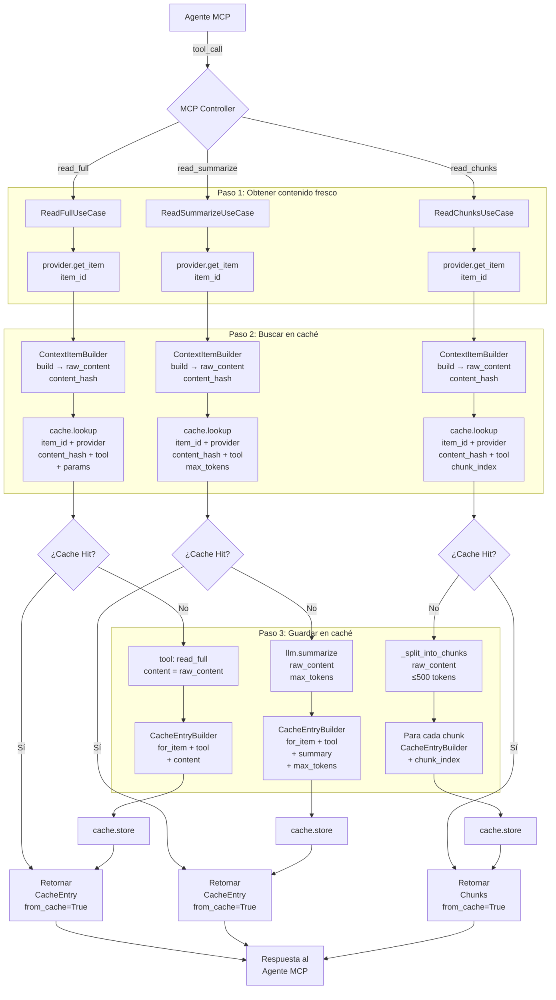
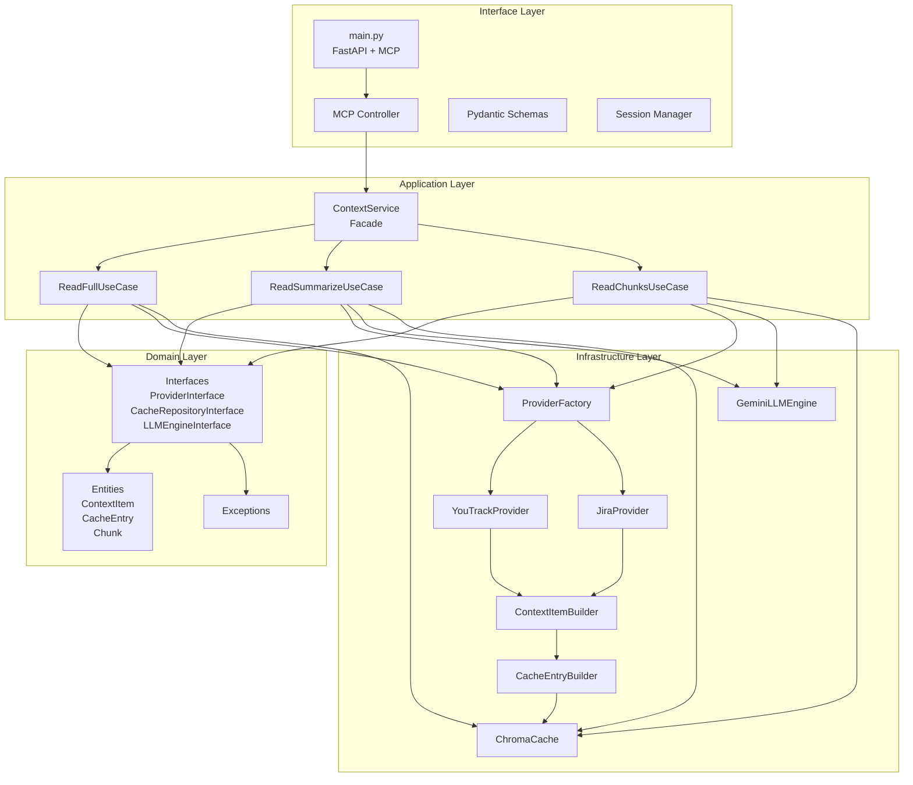
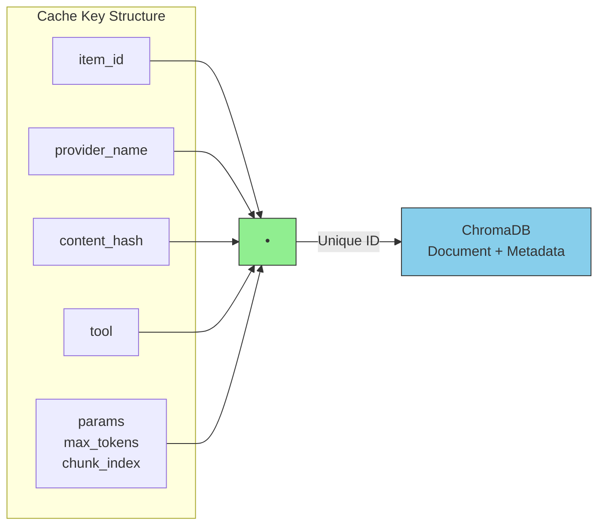
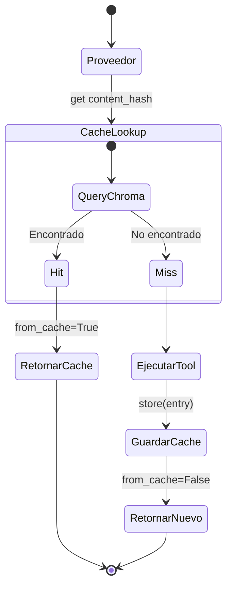
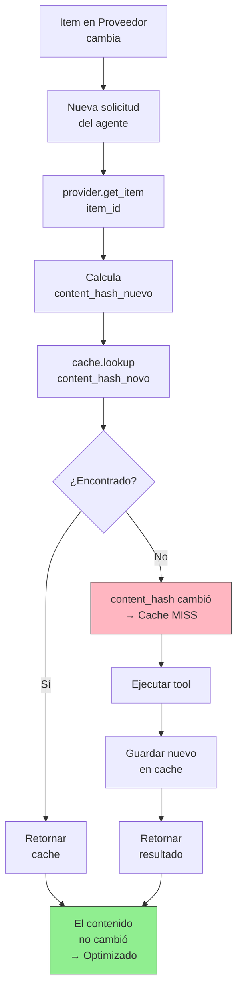
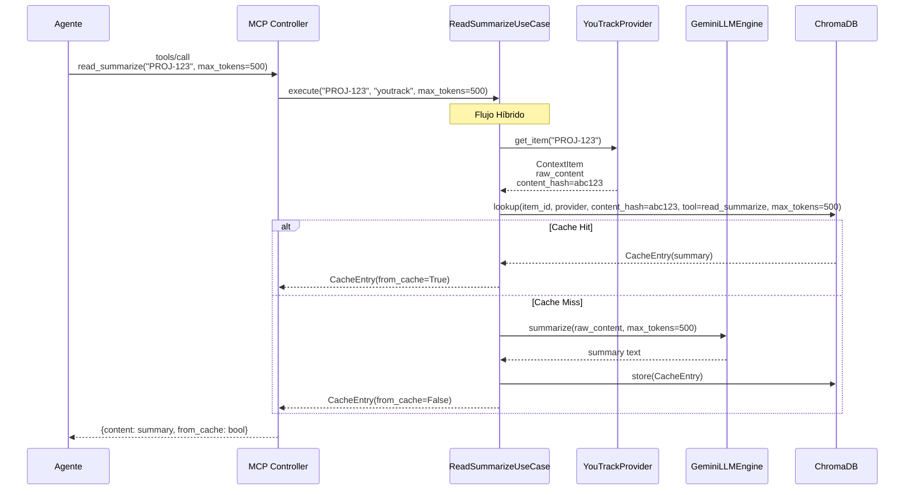

# ContextForge - Diagrama de Flujo

## Flujo Híbrido (Cache-First con Datos Frescos)

---

## Arquitectura de Capas

---

## Cache Lookup - Claves

---

## Estados de Cache

---

## Detección de Cambios

---

## Diferencias entre Tools

| Tool | Cache Key | Contenido Cacheado | Params Extra |
|------|-----------|-------------------|--------------|
| `read_full` | item_id + provider + content_hash + tool | raw_content | - |
| `read_summarize` | ... + tool + max_tokens | summary | max_tokens |
| `read_chunks` | ... + tool + chunk_index | chunk content | chunk_index |

---

## Ejemplo: Read Summarize Flow

